# Vue 3 + Vite

This template should help get you started developing with Vue 3 in Vite. The template uses Vue 3 `<script setup>` SFCs, check out the [script setup docs](https://v3.vuejs.org/api/sfc-script-setup.html#sfc-script-setup) to learn more.

## Recommended IDE Setup

- [VS Code](https://code.visualstudio.com/) + [Volar](https://marketplace.visualstudio.com/items?itemName=Vue.volar) (and disable Vetur) + [TypeScript Vue Plugin (Volar)](https://marketplace.visualstudio.com/items?itemName=Vue.vscode-typescript-vue-plugin).

## Documentation
Aplikasi Ini menggunakan framework Vue 3 & Vite (SPA) yang telah diintregasikan dengan API

### Pages & Fiturs

* Login
* Dashboard
* Data Posisi Pegawai
  * CRUD
  * Pagination
* Data Pegawai
  * CRUD
  * Pagination
* Data Gaji Pegawai
  * CRUD
  * Pagination

## Demo
* Login

* Dashboard

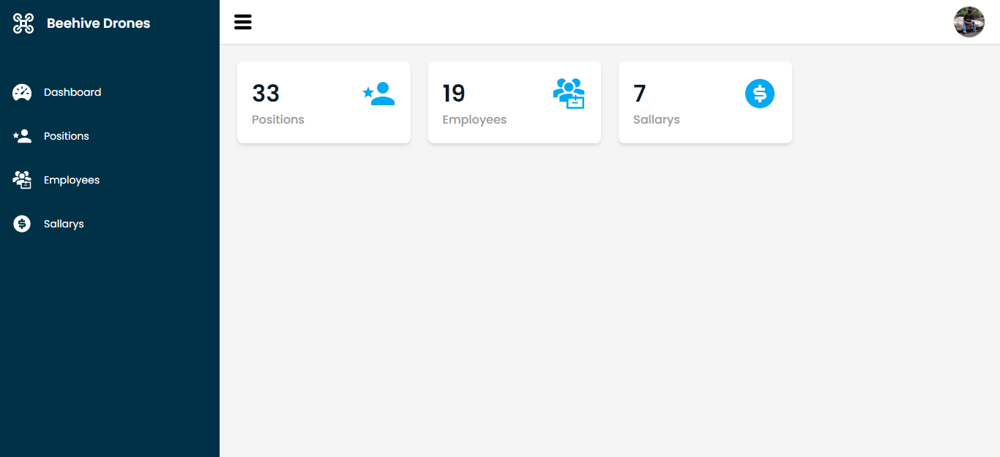

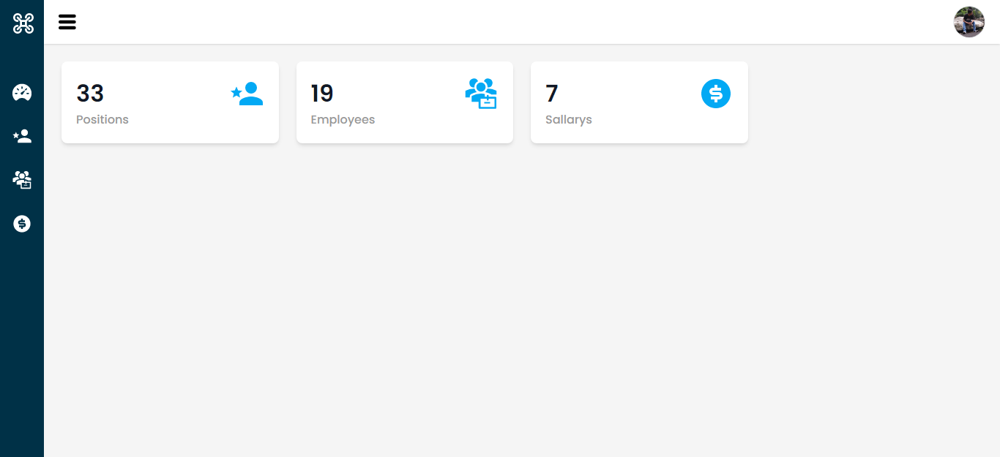

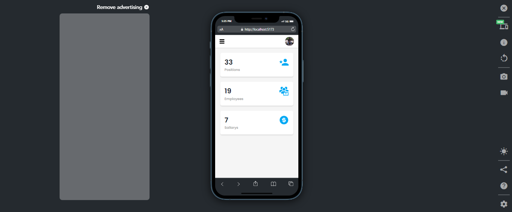

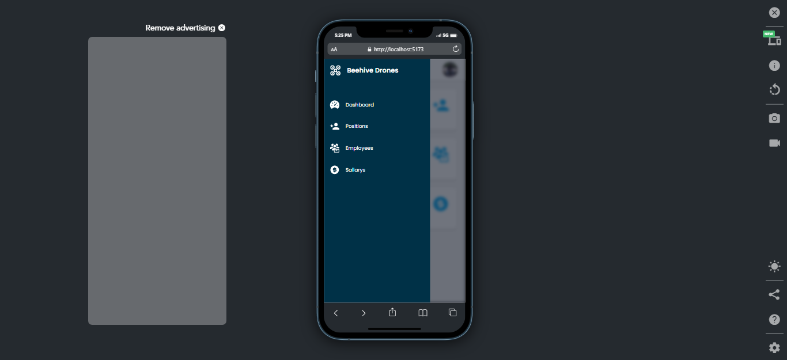
* Page Positions
    * Halaman Utama
    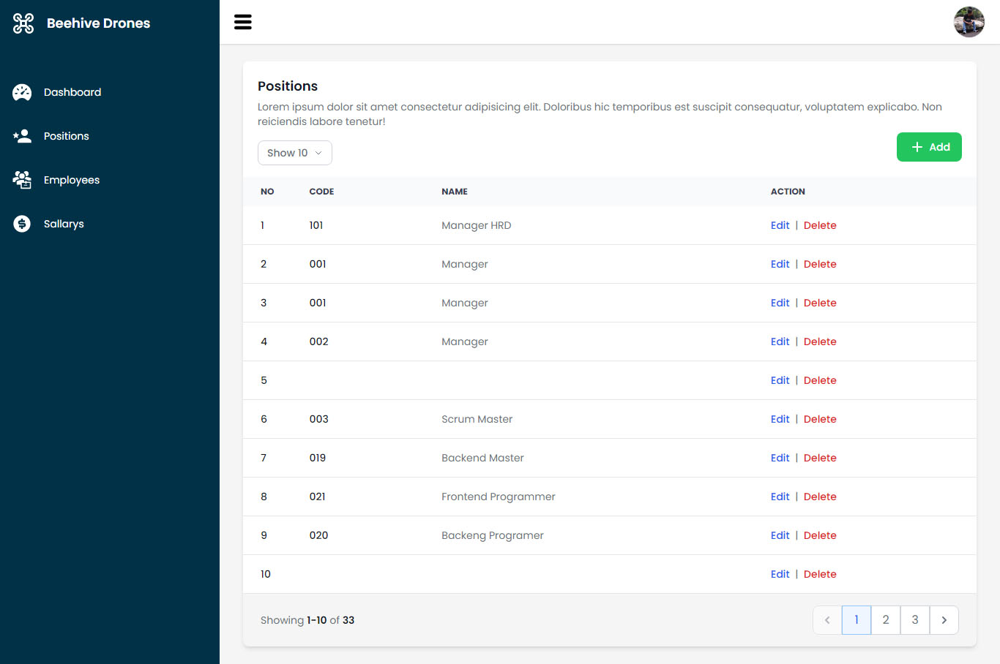
    * Tambah
    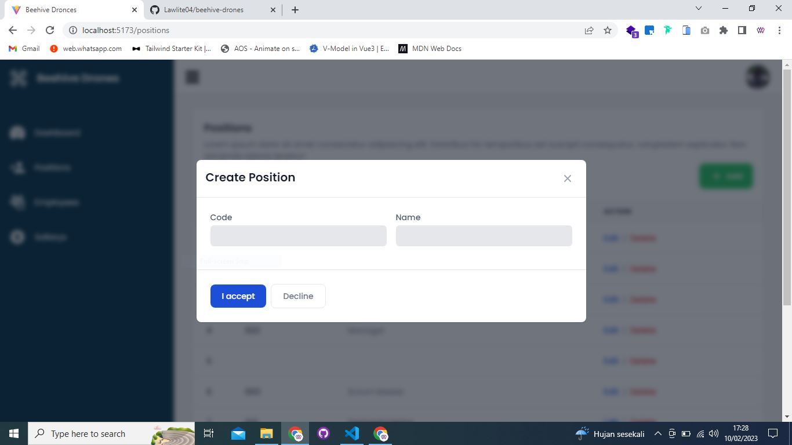
    * Edit
    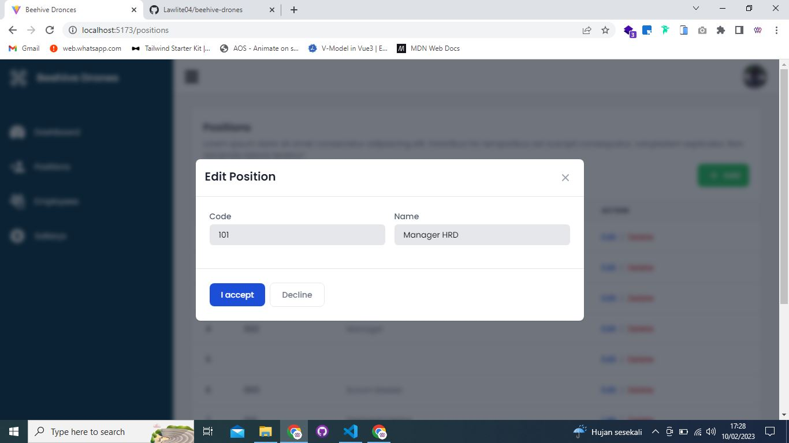
    * Hapus
    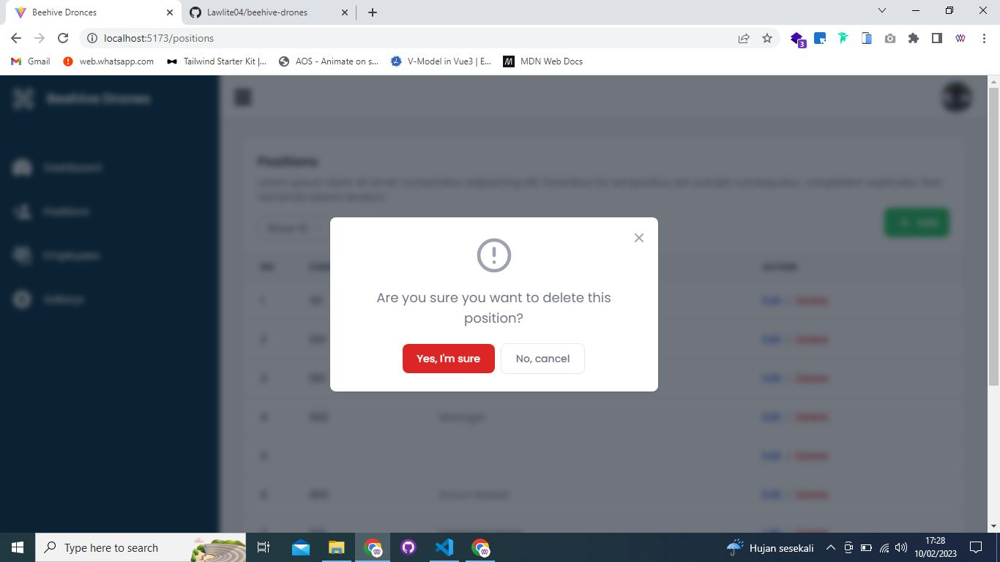
* Page Employees
    * Halaman Utama
    
    * Tambah
    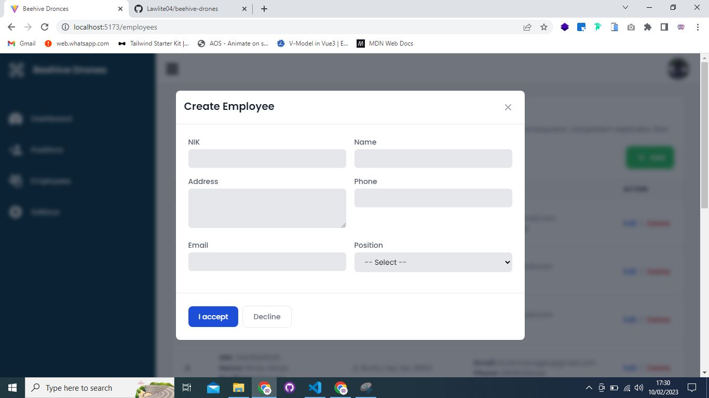
    * Edit
    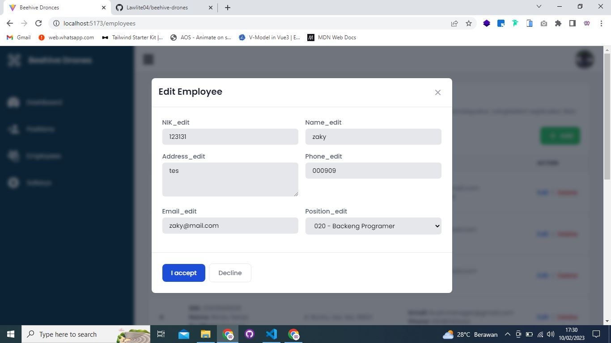
    * Hapus
    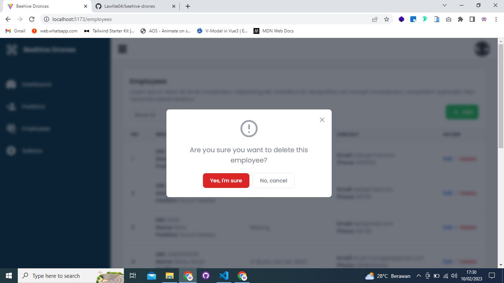
* Page Sallarys
    * Halaman Utama
    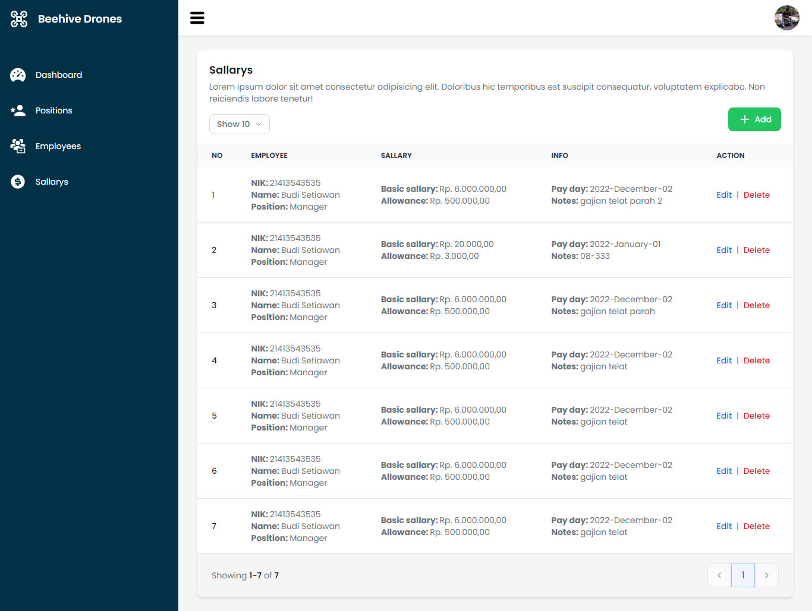
    * Tambah
    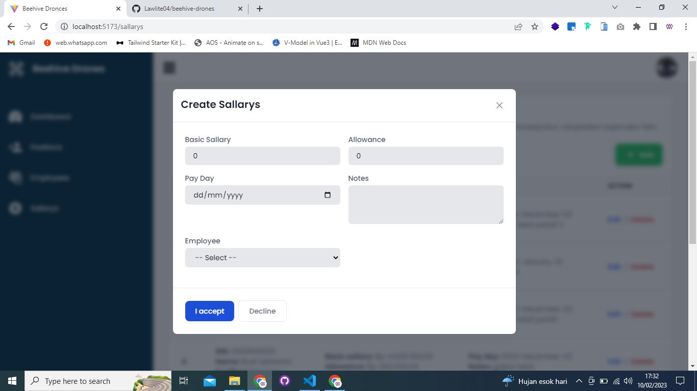
    * Edit
    
    * Hapus
    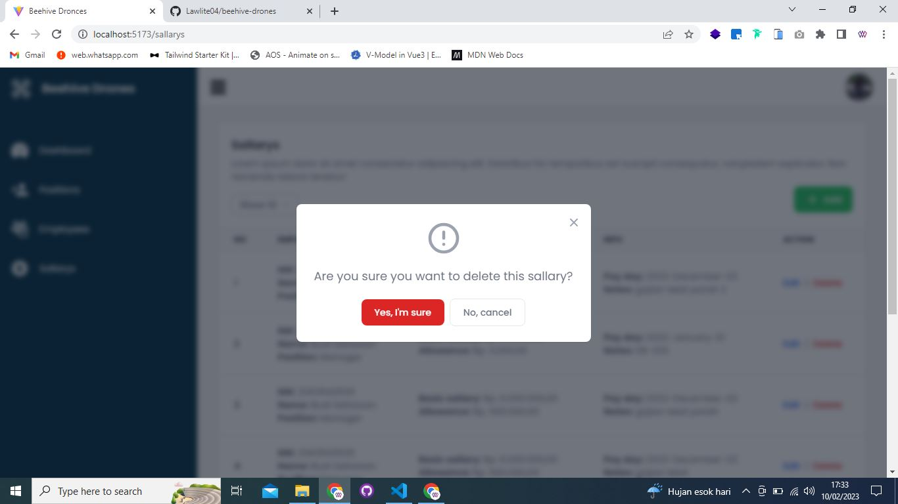

Thanks you...